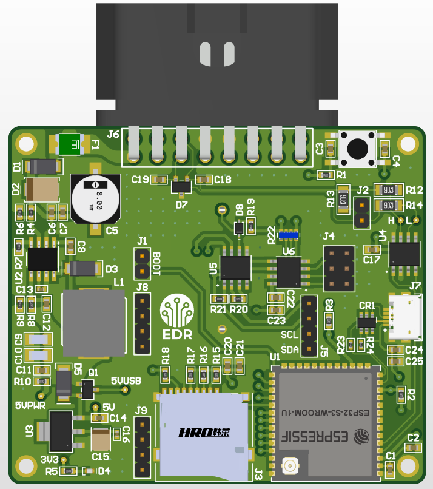
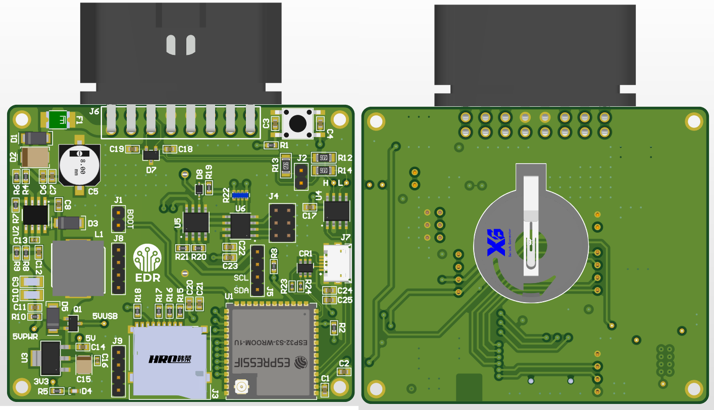
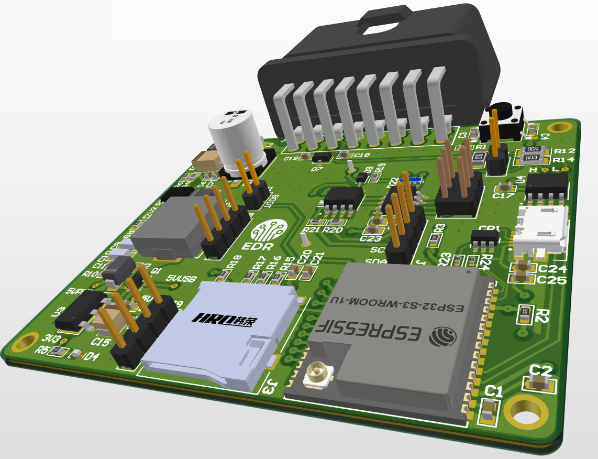
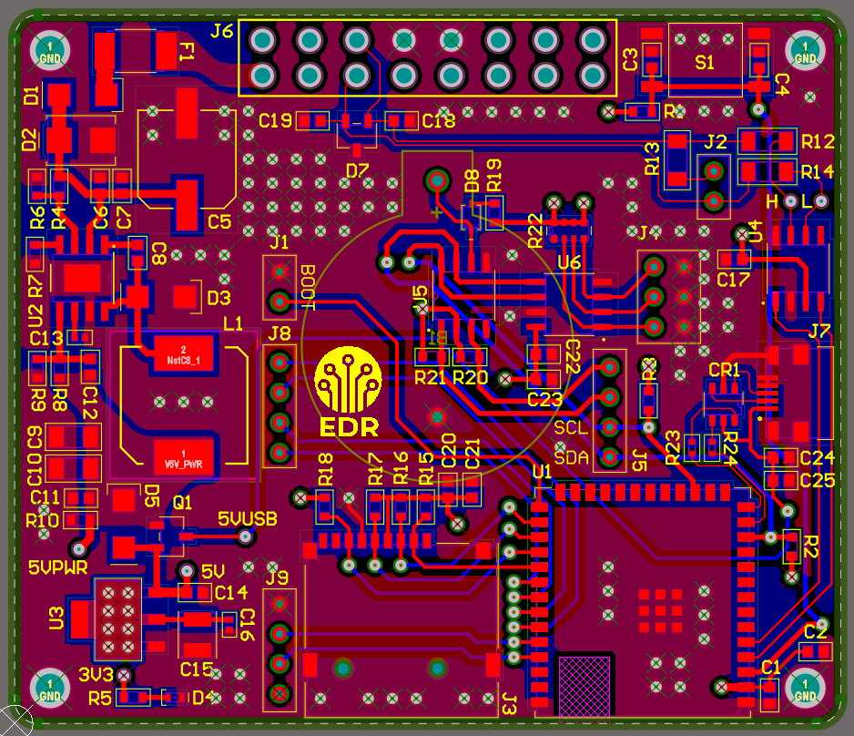
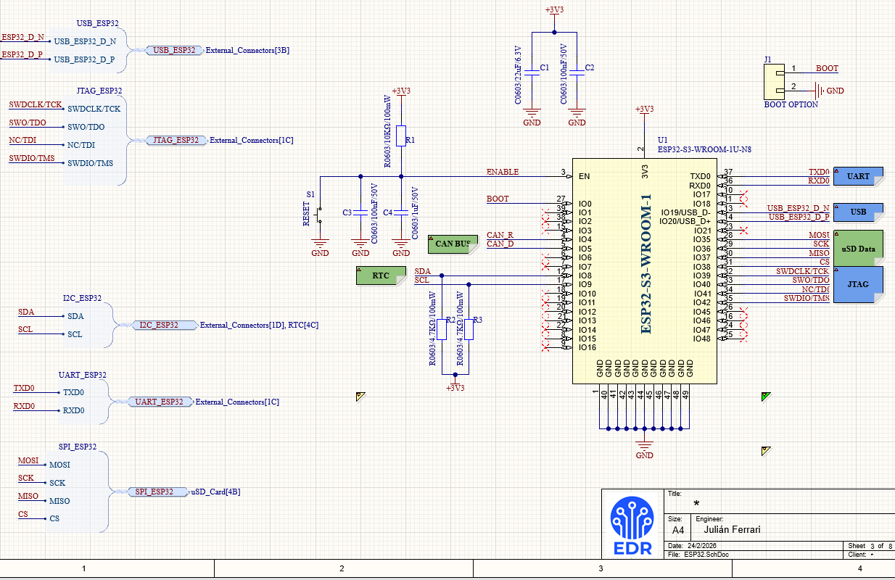

# CAN Logger - ESP32-S3

Datalogger de señales CAN para el puerto OBD II de vehículos. La placa se conecta al conector OBD II del auto y recopila la información de la ECU, guardandola en una tarjeta micro SD junto con el TAGSTAMP Time/Date, otorgado por un Real Time Clock (RTC) embebido. La placa se basa en el módulo ESP32-S3-WROOM-1U, para futuras extensiones por WiFi.
Es un diseño de 4 capas, consistente con criterios EMI/EMC, señales CAN diferencial con control de impedancia. Se tomaron en cuenta las consideraciones tanto en componentes como en capacidades de fabricación, para cumplir con criterios DFM. Realizado en Altium Designer. 

 

