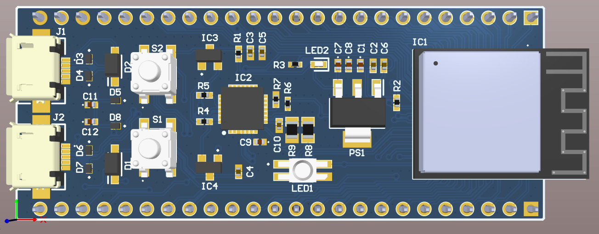
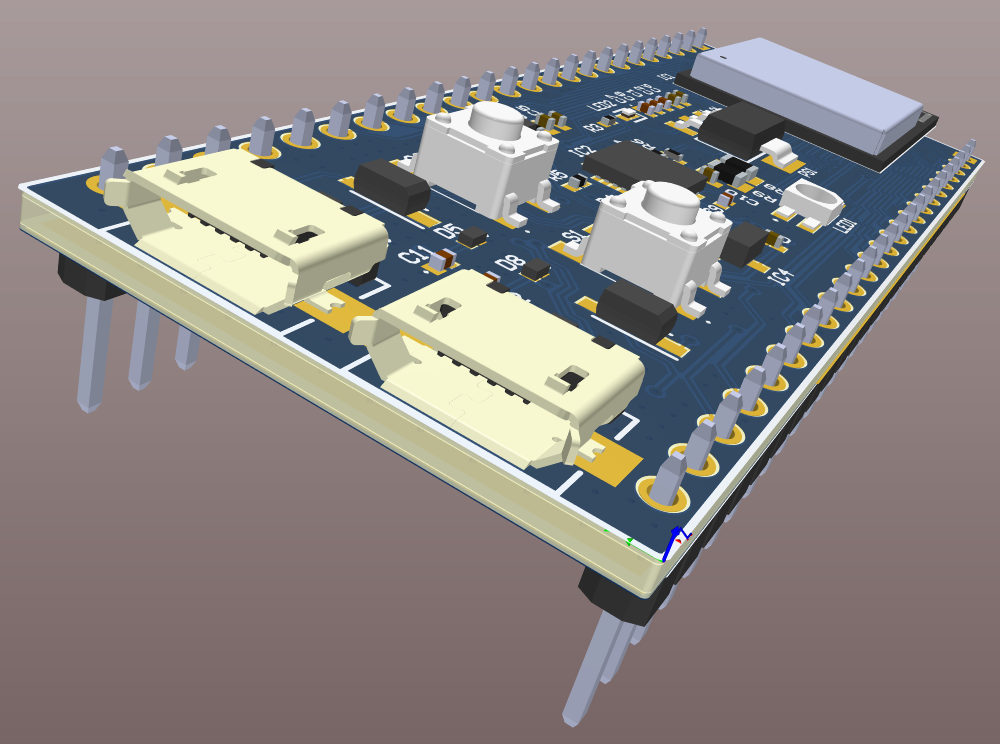
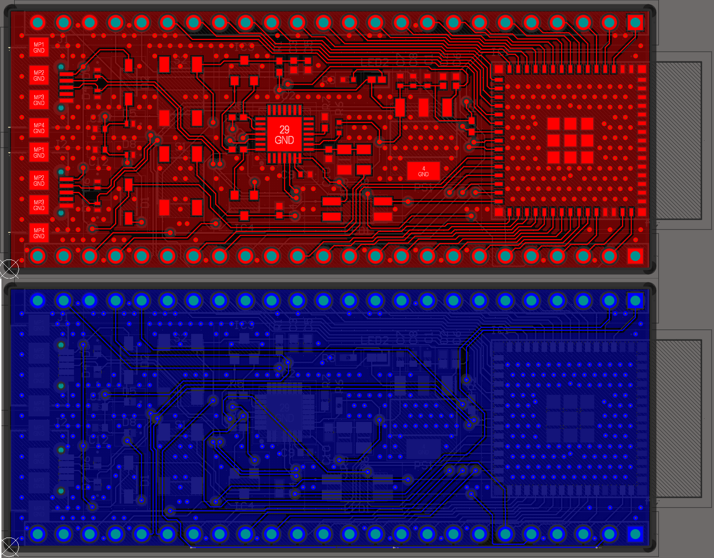
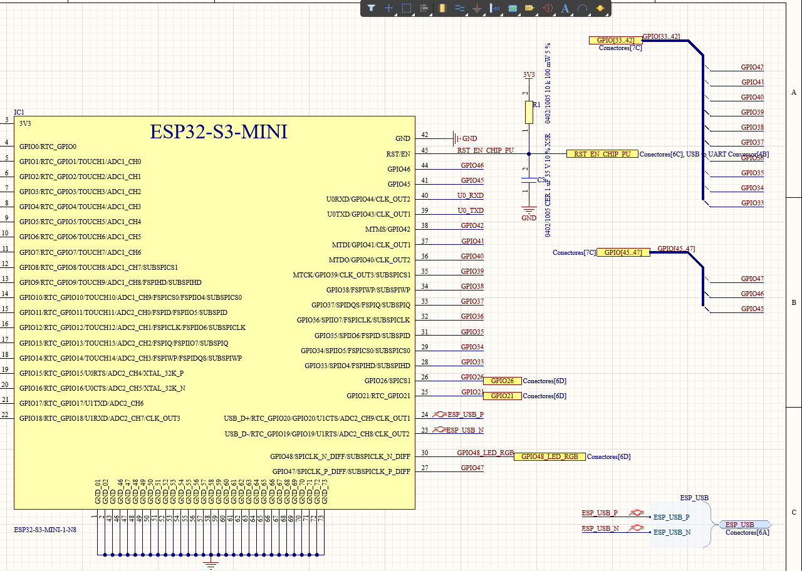

# Diseño basado en el ESP32-S3 Development Kit
Diseño de un PCB de 4 capas basado en el ESP32-S3 Development Kit - Espressif Systems. Consistente con criterios EMI/EMC para lograr una placa robusta y confiable. Realizado en Altium Designer. 

 

