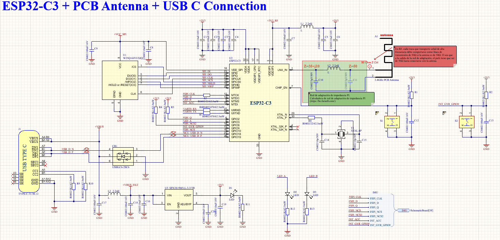
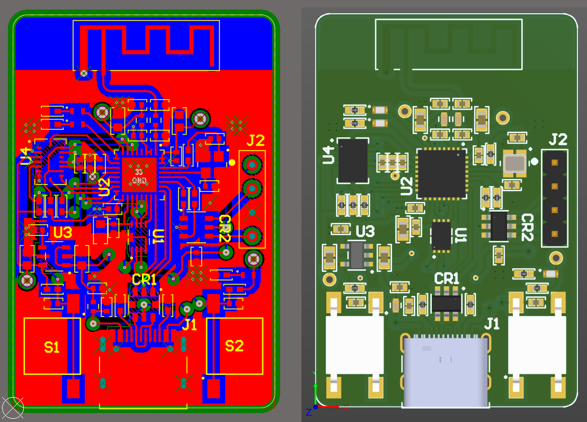
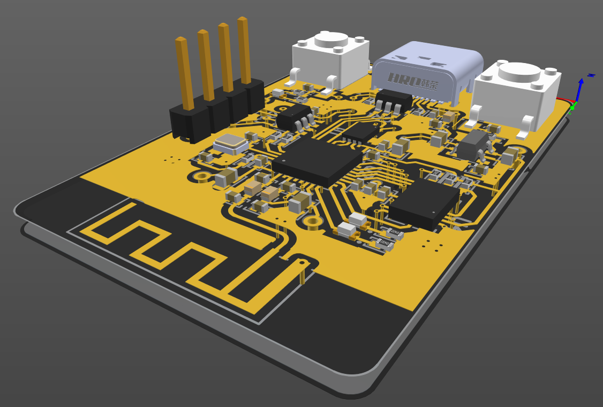
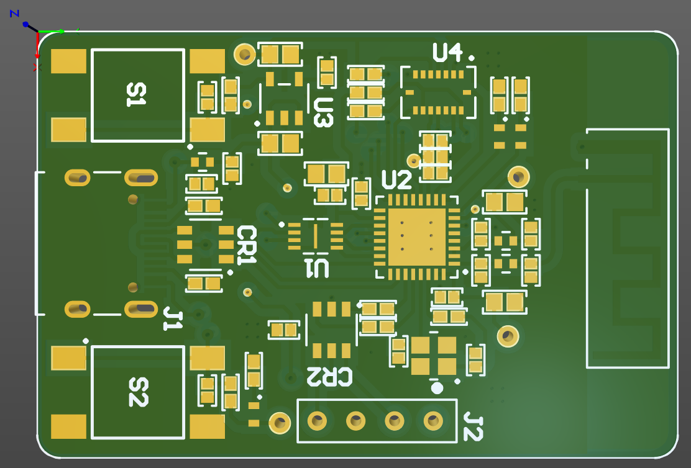
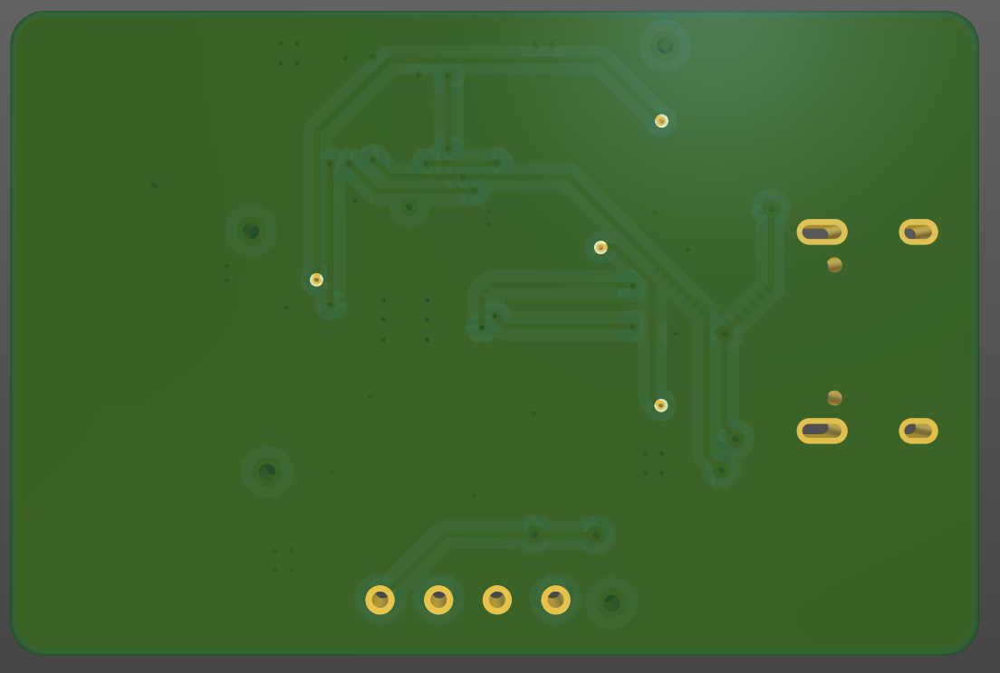

# ESP32-C3 with PCB IFA Antenna
### Experimentando con antenas IFA integradas en PCB. Diseño sobre un PCB de 4 capas, analizando cómo el layout, los planos de masa, el stackup y las redes de adaptación impactan directamente en la impedancia y la eficiencia de la antena. Me basé en la nota de aplicación AN043 "Small size 2.4GHz PCB antenna" de Texas Instruments, que describe diseño y dimensiones de antenas IFA para 2.4 GHz.

 

