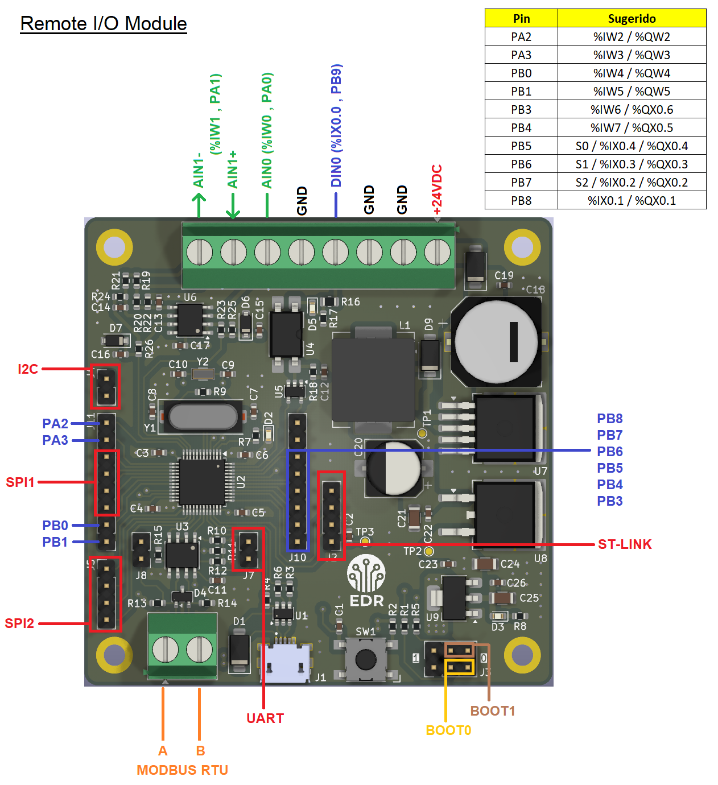

# Industrial Scada Module

Proyecto basado en el STM32F103C8T6 para ser utilizado con el software OPENPLC. Esta placa se pensó principalmente para validar tecnología y verificar su correcto funcionamiento, para poder avanzar hacia proyectos de mayor complejidad.
Con OPENPLC se puede programar directamente el micro, pudiendo programar en lenguajes como LADDER o diagrama de bloques. También se puede utilizar un puerto MODBUS RTU, valiendose del circuito integrado MAX3485 para una comunicación
industrial robusta. También se dejaron unos pines SPI libres para probar un módulo Ethernet y utilizar MODBUS TCP. 
La placa cumple con el estándar IEC 61131-3 para poder compatibilizar con otros dispositivos y sistemas SCADA. Tiene circuitería para acondicionar una entrada digital optoacoplada con el PC817, una entrada analógica de 0-10V y una entrada analógica de 4-20mA. 

 

