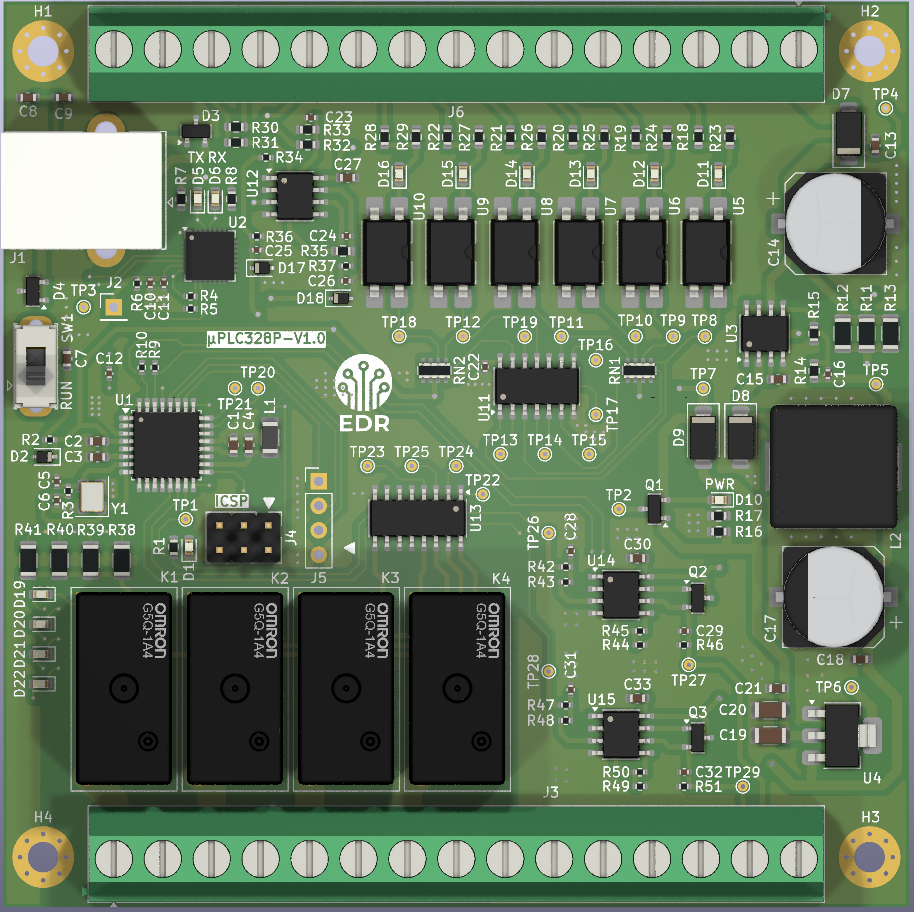
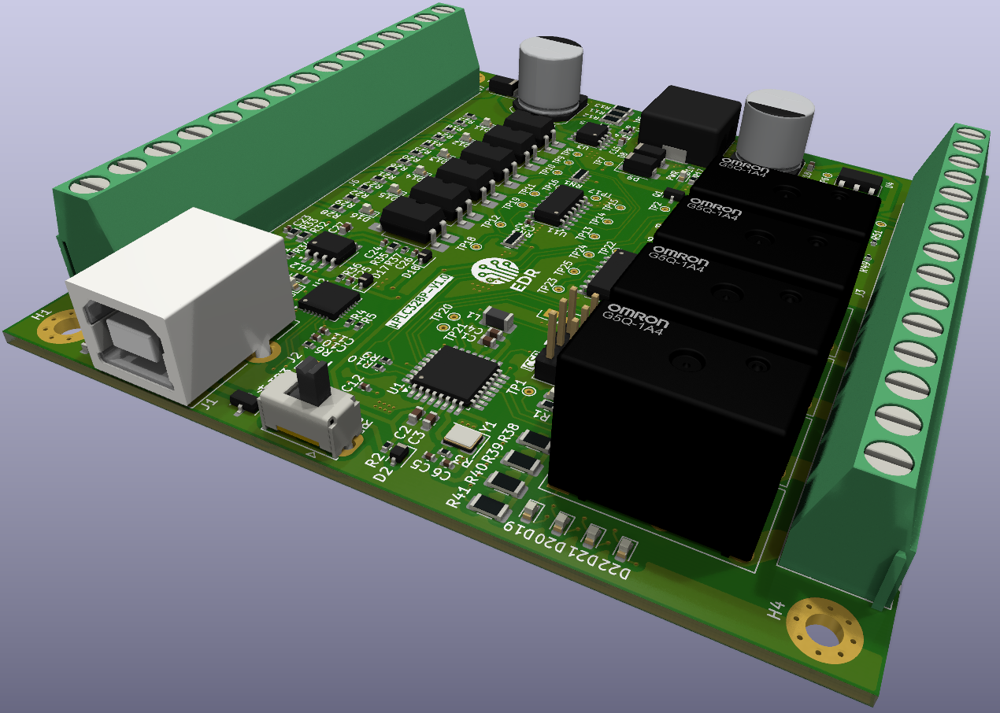

# Diseño de Micro PLC basado en ATmega328P compatible con OpenPLC.

Este diseño de PCB fue desarrollado utilizando KiCad 9, tomando como núcleo el microcontrolador ATmega328P, con el objetivo de ser compatible con OpenPLC y permitir la programación en lenguaje LADDER, conforme a la norma IEC 61131-3 para sistemas de control industrial.
El micro PLC cuenta con las siguientes características funcionales:

- 6 entradas digitales para señales de sensores o pulsadores.
- 2 entradas analógicas, configurables para 0–10V y 4–20mA
- 4 salidas digitales a relé, con capacidad de conmutar hasta 7A.
- 2 salidas PWM convertidas a señal 0–10V, para el control de iluminación u otras aplicaciones.

Durante el desarrollo utilicé las herramientas de diseño eléctrico integradas en KiCad para cumplir las normas de diseño IPC-2221, asegurando buenas prácticas de diseño como:

- Aislamiento adecuado entre pistas de alta y baja tensión.
- Trazado de pistas según corrientes nominales.
- Selección de footprints industriales y robustos.
- Identificación clara de terminales de entrada/salida.

Este proyecto apunta a facilitar el uso de OpenPLC en entornos educativos, de automatización ligera o prototipado rápido, ofreciendo una alternativa económica, flexible y fácilmente replicable para la implementación de sistemas de control industrial.

 
 
 

Las dimensiones de la placa son 94 x 94mm, de doble capa y componentes SMD y Through-Hole ubicados en la capa TOP solamente, para economizar el servicio de montaje para la fabricación en JLCPCB o PCBWAY.

 
