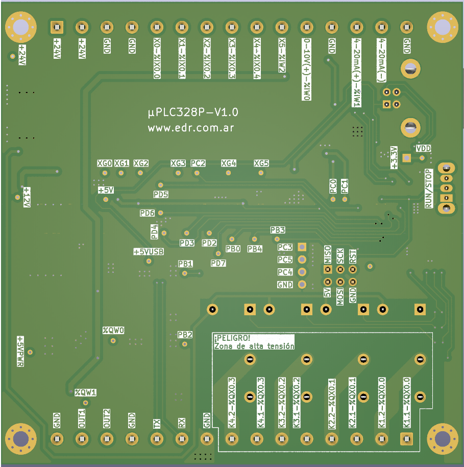
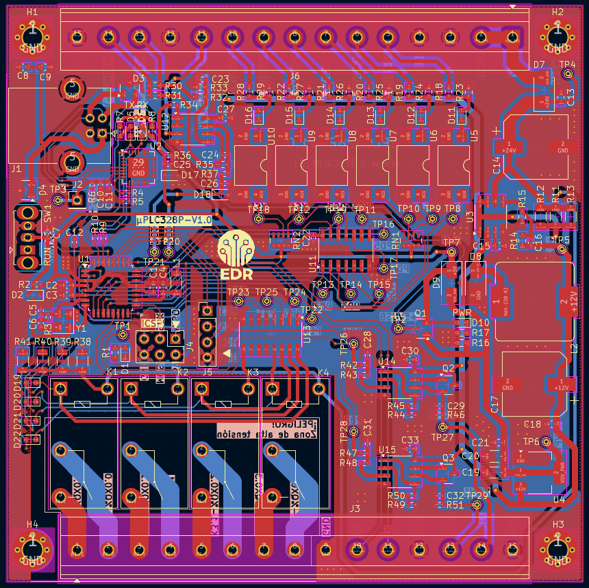

# Micro PLC basado en el Atmega328p. Este PCB lo diseñé con KICAD 9, y me basé en el microcontrolador ATMEGA328p para poder utilizarlo con OpenPLC y usar programación LADDER (Compatible con IEC 61131-3). El micro PLC tiene 6 entradas digitales, 2 entradas analogicas (0-10V y 4-20mA) y tiene 4 salidas a Relé de hasta 7A y 2 salidas PWM (0-10V).
Para el diseño utilicé las herramientas que brinda KICAD para ser consistente con las normas IPC-2221.

 
 
 
 
