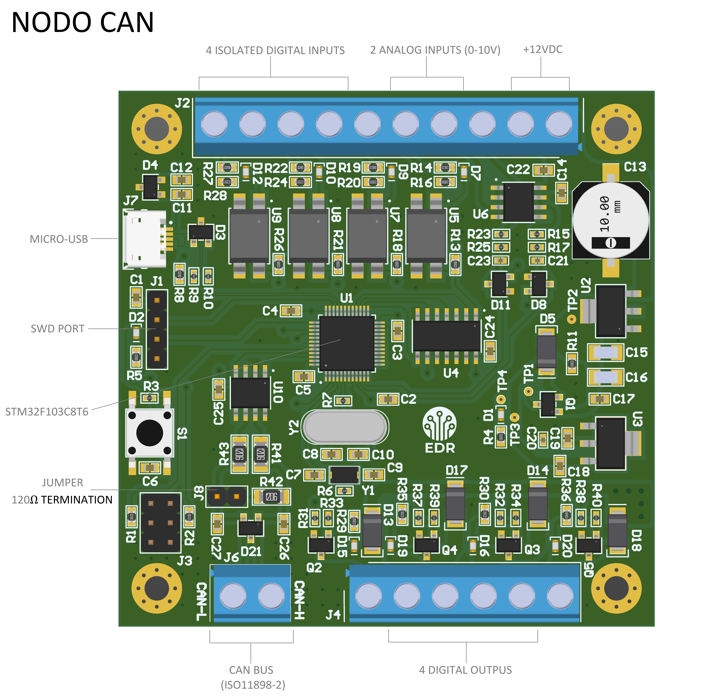
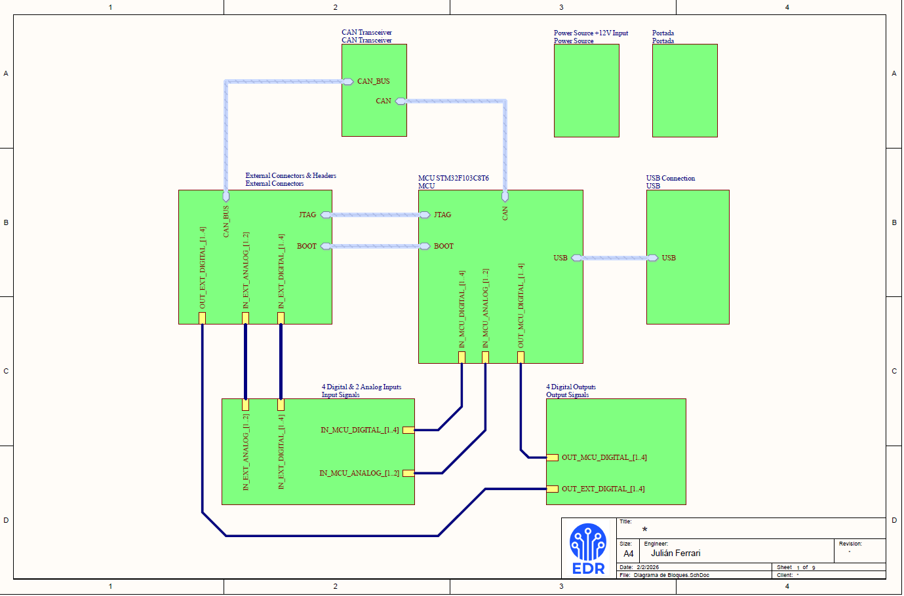
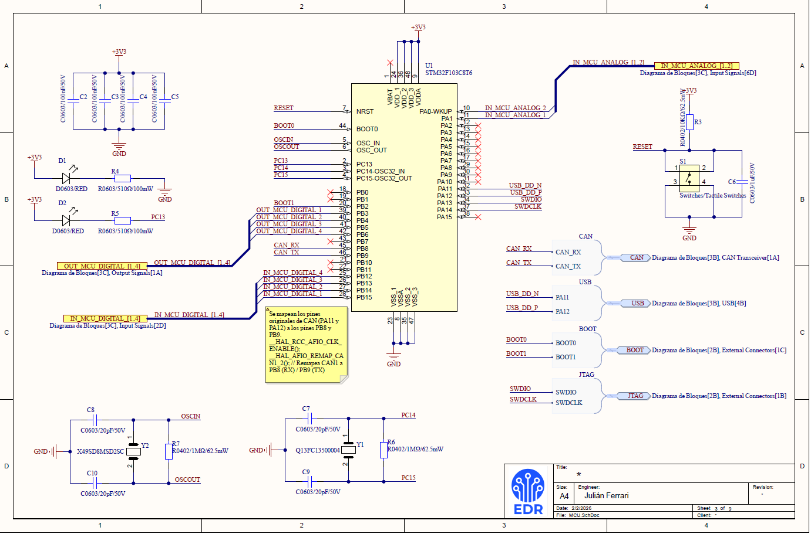
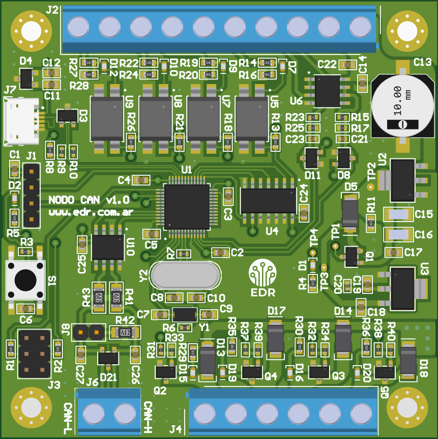
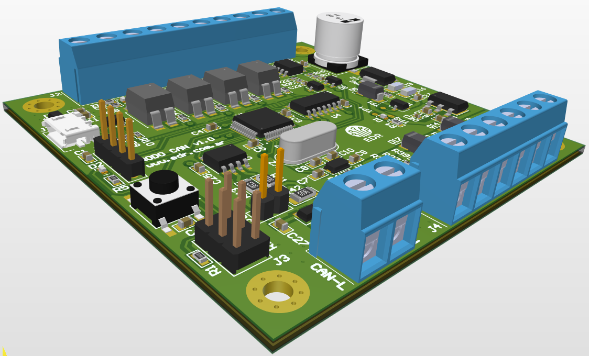
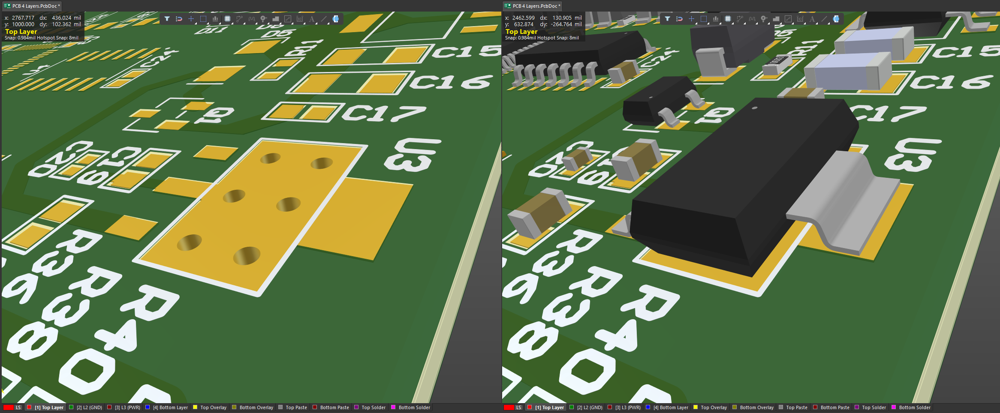
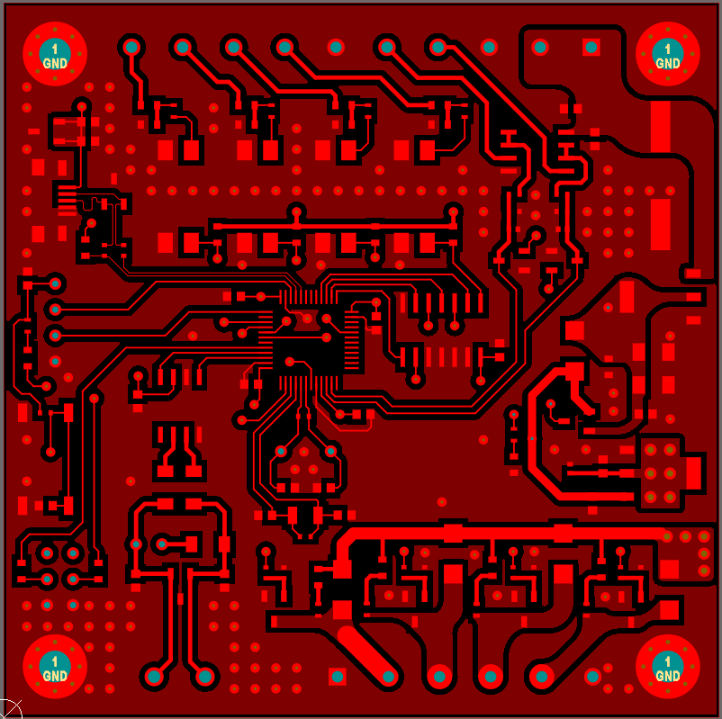
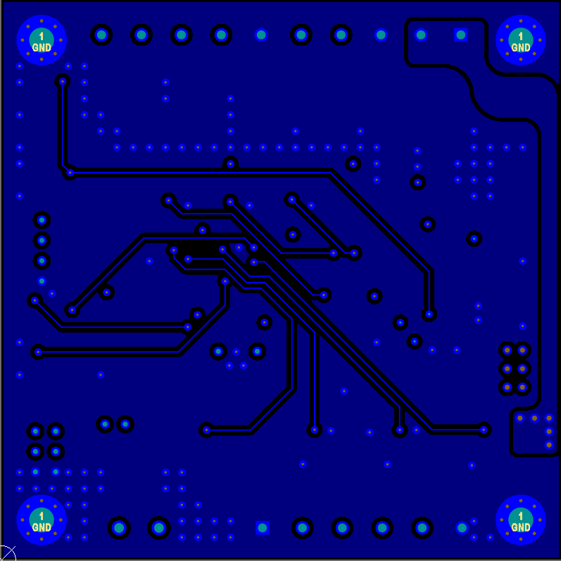

# Nodo CAN (ISO 11898-2)

Se trata de un Nodo CAN con I/O digitales para leer sensores y escribir sobre actuadores, y que pueda comunicarse a traves de un BUS CAN (ISO 11898-2, High-Speed CAN 1 Mbps). La idea es ofrecer un dispositivo simple y económico que pueda integrarse en un ecosistema existente, o crear uno a partir de estos nodos. Voy a hacer 2 entradas analógicas de 0-10V (si necesito 4-20mA uso un conversor externo), 4 entradas digitales optoacopladas (solo lectura) y 4 salidas digitales en configuración Low-Side (Sink) con MOSFET. 

Se pretende hacer un PCB de 4 capas donde se integre un STM32F103C8T6 (Bluepill) y un transceiver SN65HVD23 de Texas Instruments (al principio pensé en el TJA1050/1051, pero funciona a 5V. Para evitar inconvenientes uso el de TI que funciona a 3.3V como el STM32). El controlador CAN ya está implementado en el STM32. En este micro se utilizan las librerías HAL-CAN para el manejo del empaquetado de tramas, CRC, ACK, y todo lo que compete al protocolo CAN en sí. Luego, como capa de alto nivel, se utilizarán las librerías CANopenNODE (o algún CANopen) para que maneje los mensajes PDO/SDO (PDO  Process Data Object: Maneja datos / SDO  Service Data Object: Maneja configuraciones); es decir, para poder dialogar con otros dispositivos en alto nivel (interfaz humano-máquina). La rutina de lectura de sensores y control de actuadores lo haría en C, directamente sobre el microcontrolador.

 
 
 
 
 

 
 

