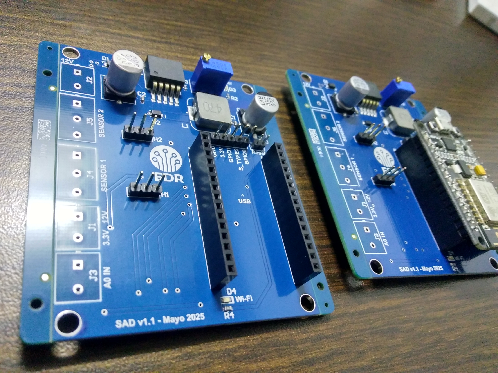
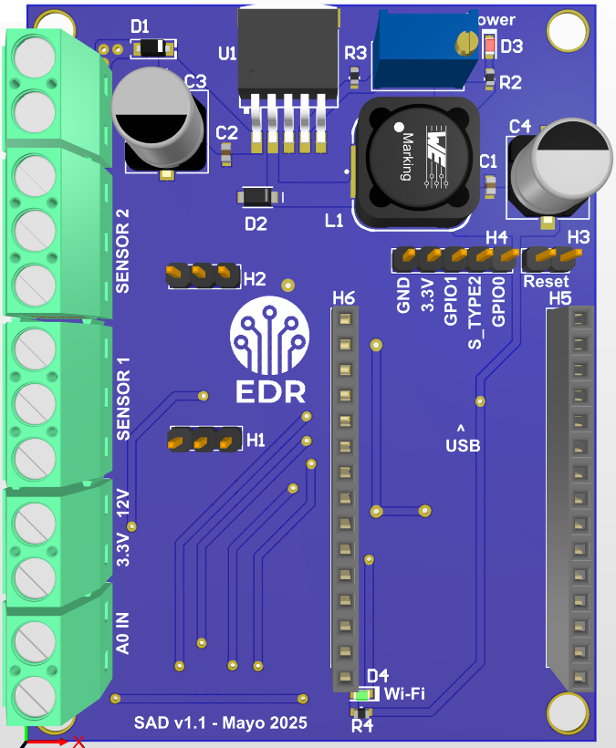
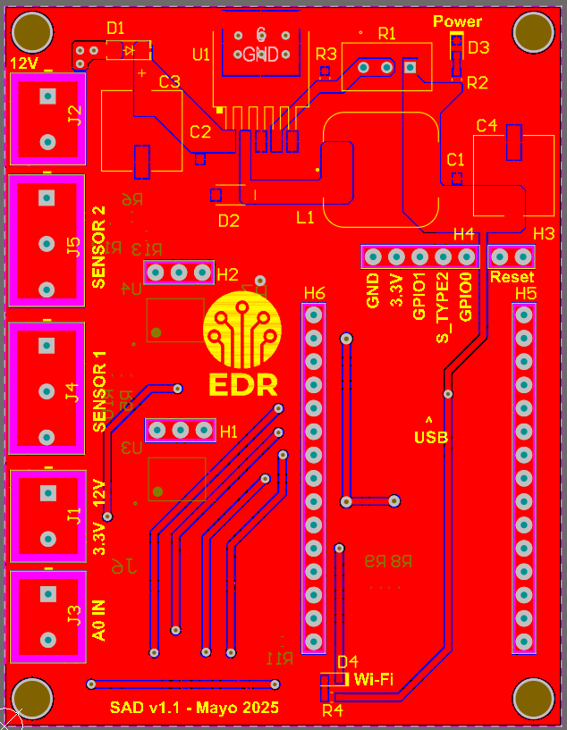
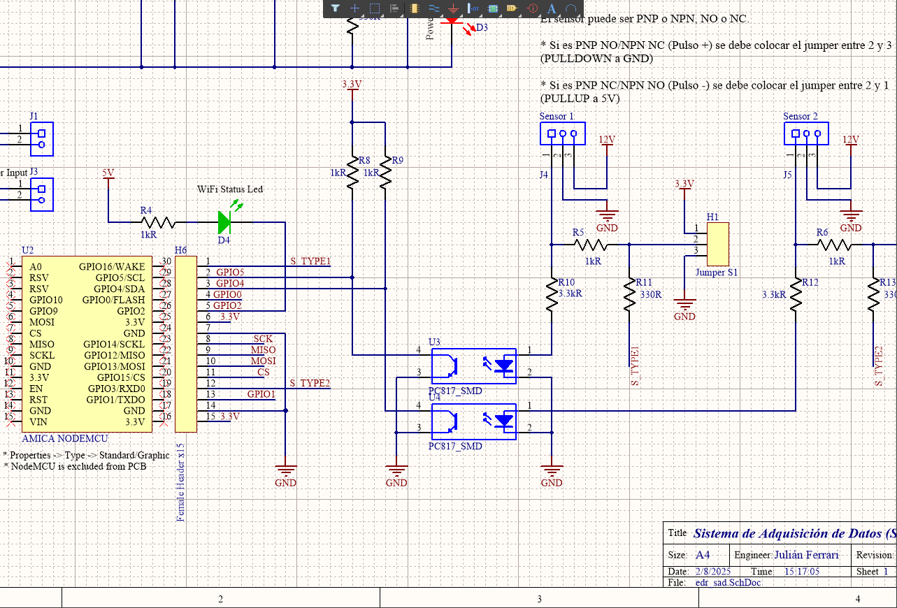

# Sistema Adquisidor de Datos (SAD)

Diseño y fabricación de un sistema para adquirir datos de sensores y subirlos a la nube. El diseño se realizó con Altium Designer y se envió a fabricar a JLCPCB.
La placa implementa una fuente step down con un LM2596, y utiliza un zócalo para colocar un NodeMCU8266, el cual recibe dos señales digitales optoacopladas (PC817). La idea es utilizar este proyecto para tareas de adquisicón de datos y publicación en la nube. 

 
 
 
 

 
